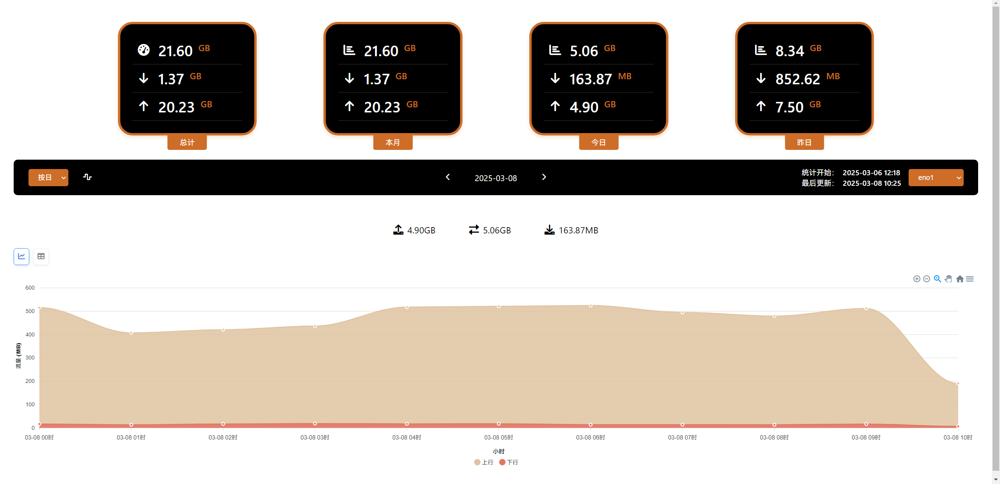
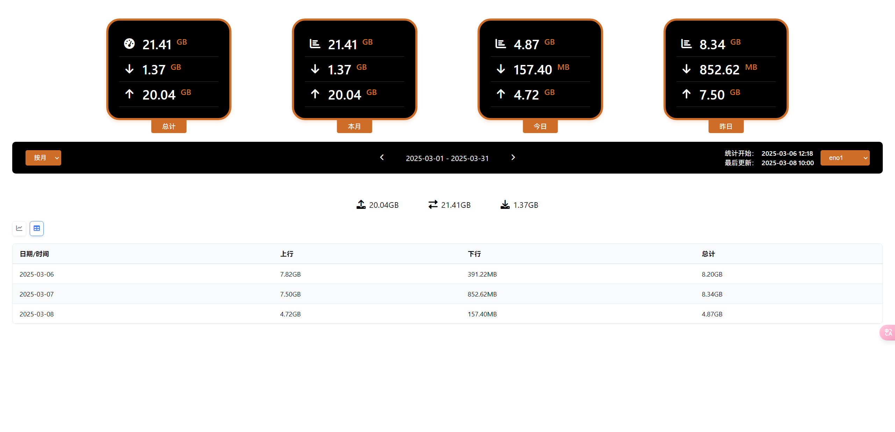
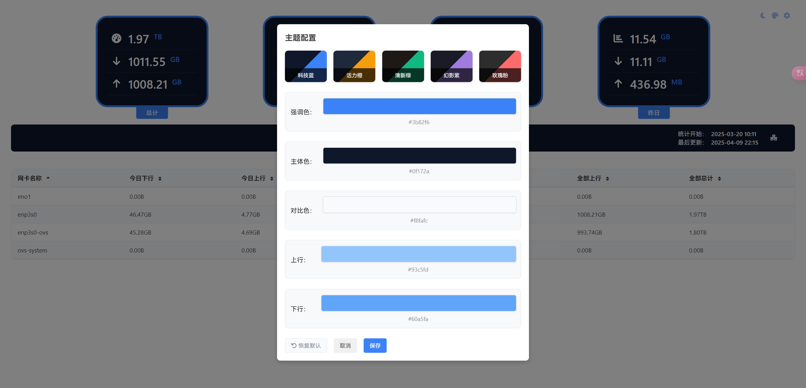
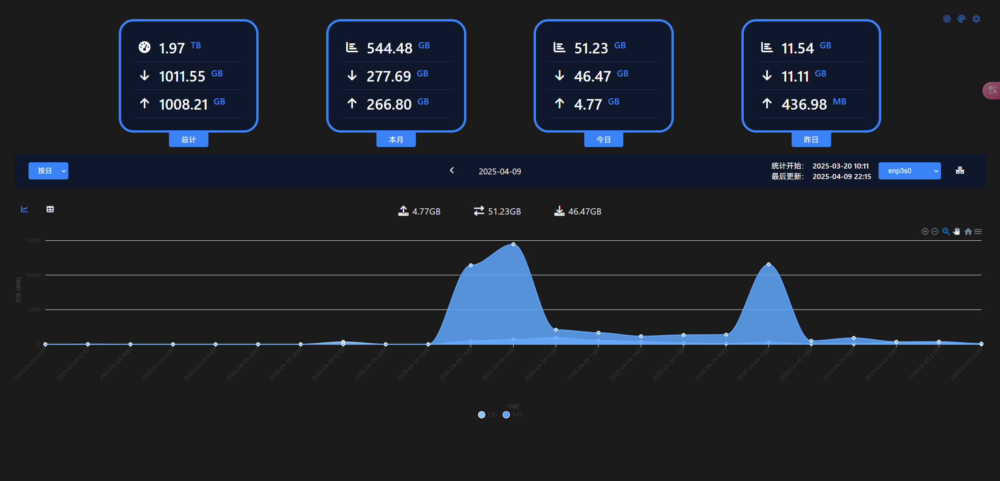

# vnstat_dashboard

基于 vnStat Api 的实时流量监控面板，提供图表展示

## 🙏 致谢

特别感谢 [hulxv/vnstat-client](https://github.com/hulxv/vnstat-client) 项目的 UI 设计参考

## 🔧 部署说明

### 安装[vnStat](https://github.com/vergoh/vnstat)


### VNSTAT 历史数据备份

由于 vnstat 的 api 能够返回的历史日期数据是有限的，所以写了个定时脚本用于定时请求 vnstat api 备份数据

提供 python 服务能够请求指定日期的备份数据

同时实现了账号密码 token 验证，作为统一入口，防止未授权查看统计数据

2025-04-04 已实现自动调用备份数据进行展示,可页面配置是否启用

2025-04-09 增加了主题设置和自动夜间模式

2025-04-11 改为python服务实现定时备份

文件结构

```
vnstat-assist ->总目录
  -shell
    -vnstat_backup.sh ->请求接口并保存昨天数据的脚本
  -api
    -api_server.py ->python api服务，获取本地文件并响应
  -www
    -vnstat_web.html -> vnstat面板
  -nginx
    -nginx.conf -> nginx配置，用于接口和页面统一出口
  -Dockerfile ->打包配置
  -docker-compose.yml ->docker构建配置,宿主机要先创建对应目录
```
### docker-compose配置
```
version: '3'
services:
  vnstat-dashboard:
    image: vnstat-dashboard:latest
    container_name: vnstat-dashboard
    restart: always
    ports:
      - "19329:80"
    volumes:
        #填写自己宿主机的路径，可以提前创建
      - :path/log/python:/app/log/python
      - :path/log/nginx:/app/log/nginx
      - :path/backups:/app/backups
    environment:
      - TZ=Asia/Shanghai
      #启用校验
      - VNA_AUTH_ENABLE=1 
      #vnstat的json数据api 
      - VNSTAT_API_URL=http://127.0.0.1:9695/json.cgi
      #后端校验秘钥
      - VNA_SECRET_KEY=secret_key
      #token有效期
      - VNA_EXPIRE_SECONDS=3600
      #后端校验账号
      - VNA_USERNAME=username
      #后端校验密码
      - VNA_PASSWORD=password
```

## 🧩 界面截图









