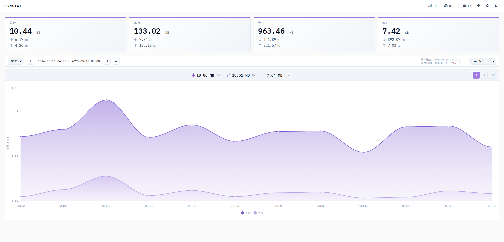
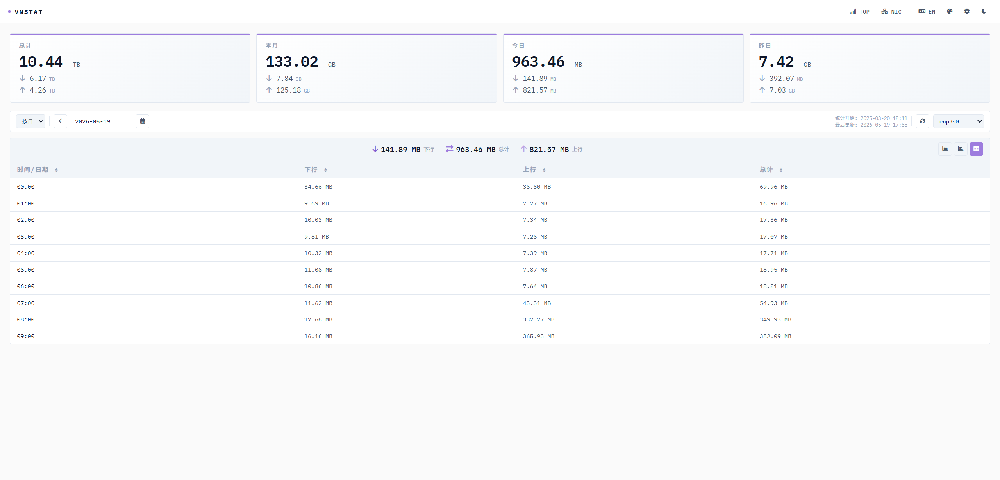
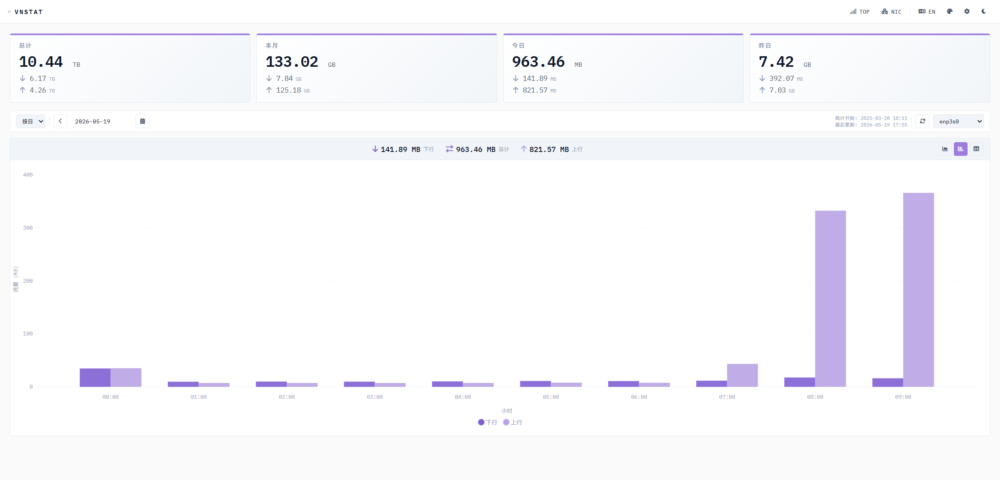
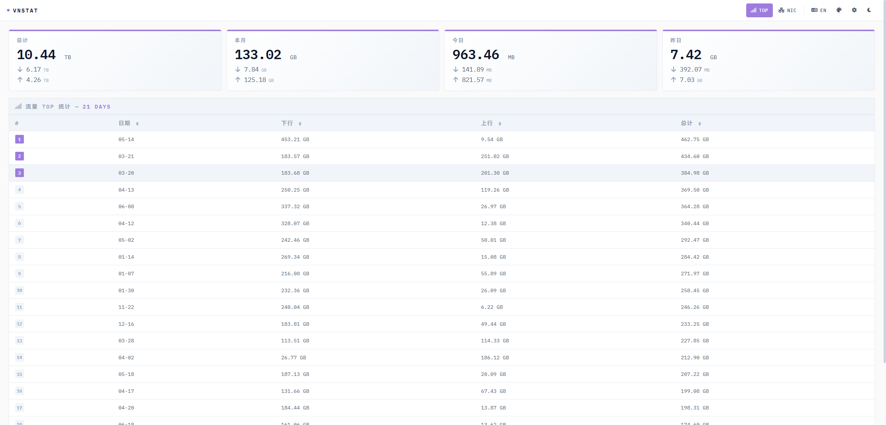
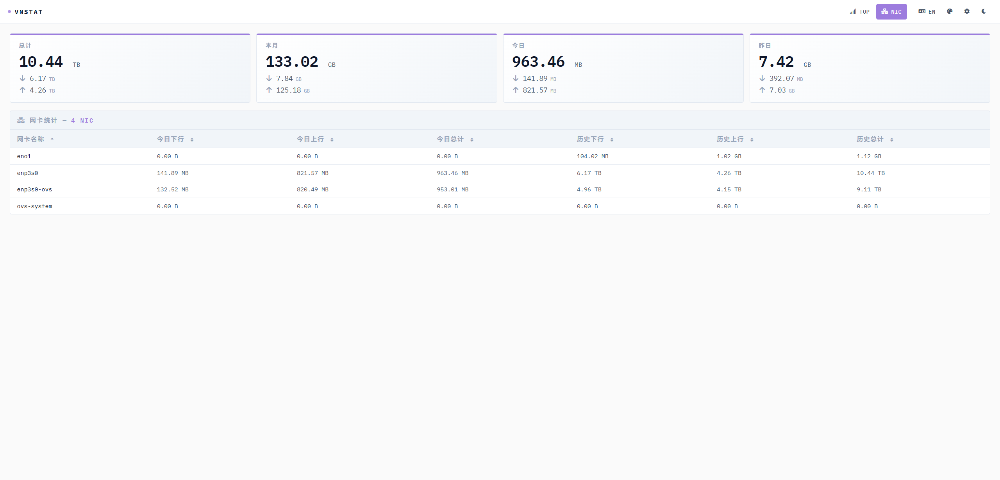

# vnstat_dashboard

<div align="center">

[](README_EN.md)
[](README.md)
<br>
[](https://hub.docker.com/r/meidlinger1024/vnstat-dashboard)
[](LICENSE)
</div>


基于 vnStat Api 的实时流量监控统计面板

## 🙏 致谢

特别感谢 [hulxv/vnstat-client](https://github.com/hulxv/vnstat-client) 项目的 UI 设计参考

## 🔰 功能说明

### 页面展示

用量统计卡片
切换网卡数据展示
不同维度展示数据用量统计
线形图/表格切换展示
用量单位自动切换
自定义主题配置

### VNSTAT历史数据备份

由于 vnstat 的 api 能够返回的历史日期数据是有限的，所以写了个定时脚本用于定时请求 vnstat api 备份数据
每天凌晨01:00自动备份前一天数据，保证记录不丢失
页面可以配置是否调用备份数据

### 页面访问鉴权

可以开启页面鉴权，供公网访问时

### 文件结构

```
vnstat-assist
├── python
│   ├── api
│   │   ├── api_server.py               ➔ API服务
│   │   ├── templates
│   │   │   └── index.html              ➔ vnstat面板
│   │   └── static                      ➔ 静态文件目录
│   │       ├── css
│   │       │   ├── all.min.css         ➔ font-awesome样式
│   │       │   └── styles.css          ➔ 自定义样式
│   │       ├── js
│   │       │   ├── apexcharts.js
│   │       │   └── vue.js
│   │       └── webfonts
│   │           └── fa-solid-900.woff2  ➔ font-awesome字体文件
│   └── backup
│       ├── task_scheduler.py           ➔ 定时执行器，调用备份服务
│       └── vnstat_backup.py            ➔ vnstat数据备份具体业务
├── conf
│   └── supervisord.conf                ➔ supervisord进程配置
├── Dockerfile                          ➔ 打包配置
└── docker-compose.yml                  ➔ docker构建配置，宿主机要先创建对应目录
  
```

## 🔧 部署说明

### 安装[vnStat](https://github.com/vergoh/vnstat)

### 检查访问vnStat api(:baseUrl/json.cgi)能够获取到JSON数据

### 拉取镜像

```
docker pull meidlinger1024/vnstat-dashboard:latest
```

### docker-compose配置
```
version: '3'
services:
  vnstat-dashboard:
    image: meidlinger1024/vnstat-dashboard:latest
    container_name: vnstat-dashboard
    restart: always
    ports:
      - "19328:19328"
    volumes:
        #填写自己宿主机的路径，可以提前创建
      - ${path-on-host}/log/python:/app/log/python
      - ${path-on-host}/backups:/app/backups
    environment:
      #启用校验
      - VNA_AUTH_ENABLE=1 
      #vnstat的json数据api,一般是http://${host}:8685/json.cgi
      - VNSTAT_API_URL=http://${host}:${port}/json.cgi
      #后端校验秘钥
      - VNA_SECRET_KEY=${secret_key}
      #token有效期
      - VNA_EXPIRE_SECONDS=3600
      #后端校验账号
      - VNA_USERNAME=${username}
      #后端校验密码
      - VNA_PASSWORD=${password}
```

### docker run配置

```
docker run -d \
  --name vnstat-dashboard \
  -p 19328:19328 \
  -v ${path-on-host}/log/python:/app/log/python \
  -v ${path-on-host}/backups:/app/backups \
  -e VNA_AUTH_ENABLE=1 \
  -e VNSTAT_API_URL=http://${host}:${port}/json.cgi \
  -e VNA_SECRET_KEY=${secret_key} \
  -e VNA_EXPIRE_SECONDS=3600 \
  -e VNA_USERNAME=${username} \
  -e VNA_PASSWORD=${password} \
  meidlinger1024/vnstat-dashboard:latest
```

## 🧩 界面截图










