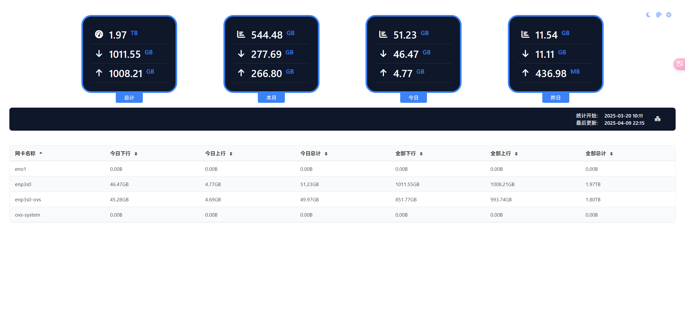

# vnstat_dashboard

基于vnStat Api的实时流量监控面板，提供图表展示

## 🙏 致谢

特别感谢 [hulxv/vnstat-client](https://github.com/hulxv/vnstat-client) 项目的UI设计参考

## 🔧 部署说明

### 安装[vnStat](https://github.com/vergoh/vnstat)

### API配置要求

```
替换vnStatApi为对应vnstat api 一般为host:8685/json.cgi
```


### VNSTAT 历史数据备份

由于vnstat的api能够返回的历史日期数据是有限的，所以写了个定时脚本用于定时请求vnstat api备份数据

提供简易python服务能够请求指定日期的备份数据

文件结构

```
handle_backup ->备份操作文件夹
  -shell 
    -vnstat_backup.sh ->请求接口并保存昨天数据的脚本
  -api 
    -api_server.py ->python api服务，获取本地文件并响应
  -docker
    -Dockerfile
    -docker-compose.yml
```

#### TODO:vnstat api获取不到对应范围的数据时候调用备份数据接口展示

### nginx配置参考

```
#vnstat可视化页面
location /traffic/ {
    alias /var/www/html/;
    index vnstat_web.html;
    try_files $uri $uri/ /traffic/vnstat_web.html;
}
#vnstat数据备份
location /json-vnstat/ {
    rewrite ^/json-vnstat/(.*) /vnstat/$1 break;
    proxy_pass $proxy_pass;
    proxy_http_version 1.1;
    proxy_set_header Host $host;
    proxy_set_header X-Real-IP $remote_addr;
    proxy_set_header X-Forwarded-For $proxy_add_x_forwarded_for;
    proxy_set_header X-Forwarded-Proto $scheme;
    # CORS 配置
    add_header 'Access-Control-Allow-Origin' '*' always;
    add_header 'Access-Control-Allow-Methods' 'GET, OPTIONS' always;
    add_header 'Access-Control-Allow-Headers' 'Content-Type,Authorization' always;
    add_header 'Access-Control-Max-Age' 1728000 always;
    if ($request_method = 'OPTIONS') {
        return 204;
    }
}
```
## 🧩界面截图



