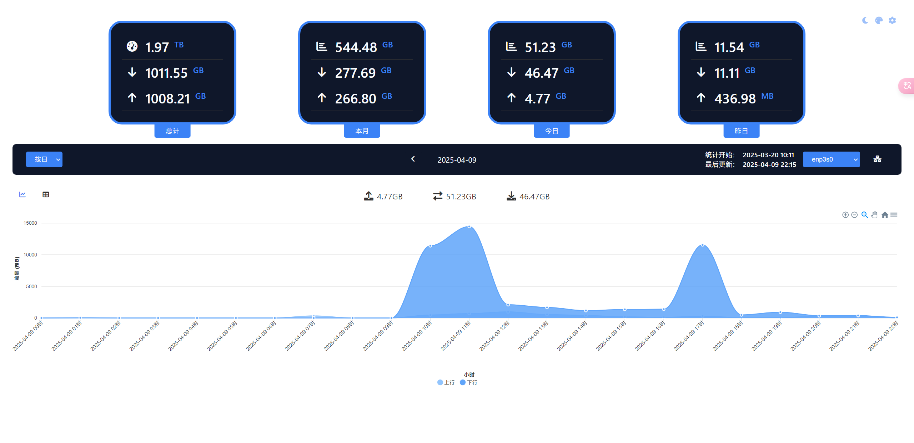

[](README.md)
[](README_EN.md)

# vnstat_dashboard

Real-time Traffic Monitoring and Statistics Dashboard Based on vnStat API

## 🙏 Acknowledgments

Special thanks to the [hulxv/vnstat-client](https://github.com/hulxv/vnstat-client) project for UI design reference.

## 🔰 Features

### Page Display

- Usage statistics cards
- Network interface data switching
- Multi-dimensional traffic usage statistics
- Line chart/table view switching
- Automatic unit switching for traffic usage
- Custom theme configuration

### VNSTAT Historical Data Backup

Since the vnstat API has limited historical data retention, we implemented a scheduled backup script:
- Automatically backs up previous day's data at 01:00 daily
- Preserves complete historical records
- Configurable backup data usage in the interface

### Page Access Authentication

Enable authentication for public network access

### File Structure

```
vnstat-assist
  -www
    -vnstat_web.html -> dashboard page
  -python
    -api
      -api_server.py ->API service
    -backup
      -task_scheduler.py ->Timed executor to invoke backup service
      -vnstat_backup.py ->Backup service implementation
  -conf
    -nginx.conf ->Nginx configuration for page and API proxy
    -supervisord.conf ->Process configuration
  -Dockerfile ->Docker build configuration
  -docker-compose.yml ->Docker compose config, ensure host directories exist
  
```

## 🔧 Deployment

### Install [vnStat](https://github.com/vergoh/vnstat)

### Verify API accessibility: Access `http://[server]:[port]/json.cgi` to ensure JSON response

### Pull Docker Image

```
docker pull meidlinger1024/vnstat-dashboard:latest
```
### Docker Run Configuration

```

docker run -d \
  --name vnstat-dashboard \
  -p 19329:80 \
  -v ${path-on-host}/log/python:/app/log/python \
  -v ${path-on-host}/log/nginx:/app/log/nginx \
  -v ${path-on-host}/backups:/app/backups \
  -e VNA_AUTH_ENABLE=1 \
  -e VNSTAT_API_URL=http://${host}:${port}/json.cgi \
  -e VNA_SECRET_KEY=${secret_key} \
  -e VNA_EXPIRE_SECONDS=3600 \
  -e VNA_USERNAME=${username} \
  -e VNA_PASSWORD=${password} \
  vnstat-dashboard:latest
```

### Docker Compose Configuration
```
version: '3'
services:
  vnstat-dashboard:
    image: vnstat-dashboard:latest
    container_name: vnstat-dashboard
    restart: always
    ports:
      - "19329:80"
    volumes:
        # Specify host machine paths (create them first if needed)
      - ${path-on-host}/log/python:/app/log/python
      - ${path-on-host}/log/nginx:/app/log/nginx
      - ${path-on-host}/backups:/app/backups
    environment:
      # Enable authentication
      - VNA_AUTH_ENABLE=1
      # vnStat JSON API endpoint 
      - VNSTAT_API_URL=http://${host}:${port}/json.cgi
      # Authentication secret key
      - VNA_SECRET_KEY=${secret_key}
      # Token expiration time (seconds)
      - VNA_EXPIRE_SECONDS=3600
      # Authentication username
      - VNA_USERNAME=${username}
      # Authentication password
      - VNA_PASSWORD=${password}
```

## 🧩 Screenshots




